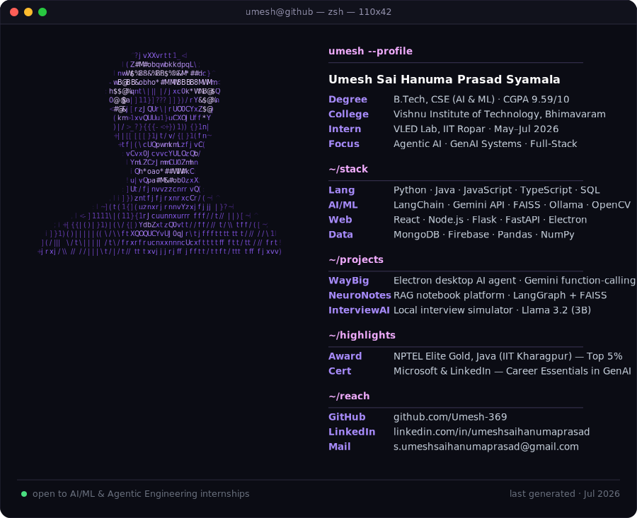

<h1 align="center">Hi there, I'm Umesh 👋</h1>

I don't just learn AI — I build with it. Whether it's an agent with real shell access to a user's machine or a RAG pipeline that cuts through document clutter, I care about systems that actually work outside a notebook.

  <picture>
    <source media="(prefers-color-scheme: dark)" srcset="./assets/dark.svg">
    <source media="(prefers-color-scheme: light)" srcset="./assets/light.svg">
    
  </picture>

---

### 🛠️ Tech Stack

**Programming:**     

**Core CS:** Data Structures · Algorithms · OOP · DBMS

**AI / GenAI:**   FAISS · Ollama 

**Libraries:**    Matplotlib · Seaborn

**Frameworks & Runtimes:**     Express 

**Tools & Platforms:**     Google Colab 

---

### 🚀 Projects

| Project | Stack | Description |
|---|---|---|
| **[WayBig](https://github.com/Umesh-369/WAYBIG)**  Jul 2026 | Electron, React, TypeScript, Node.js, Gemini API | Cross-platform desktop AI agent with an autonomous Gemini function-calling loop giving direct file system & shell access. Safety-first architecture with human-in-the-loop confirmation gates, diff previews, and audit logging for destructive actions. |
| **NeuroNotes**  Mar 2026 | RAG, LangGraph, Gemini API, FAISS/ChromaDB | Full-stack AI notebook platform using RAG for context-aware querying across documents — improved response relevance, reduced hallucinations. LangGraph-based agent for multi-turn conversational interactions. |
| **InterviewAI**  Apr 2026 | Python, FastAPI, Ollama (Llama 3.2), pdfplumber | Fully local AI-powered technical interview simulator generating resume-aware questions via Llama 3.2 (3B) — zero cloud APIs, zero data leaks. FastAPI backend with session management, PDF parsing, and post-interview hire/no-hire reports. |

---

### 💼 Experience

**Summer Intern** — VLED Lab, IIT Ropar · May 2026 – Jul 2026
Contributing to open-source projects involving AI and the MERN stack.

**AI-ML Virtual Intern** — EduSkills (AICTE – National Internship Portal) · Apr 2026 – Jun 2026
Completed an 8-week AICTE-recognized virtual internship in AI & ML, supported by Google for Developers under the India Edu Program. Hands-on experience in model development, data analysis, and generative AI tools.

---

### 🏆 Activities & Awards

- ☕ **NPTEL Elite Gold** — Programming in Java (IIT Kharagpur), 95% consolidated score, Top 5% nationwide
- 📜 **Microsoft & LinkedIn Certified** — Career Essentials in Generative AI
- 👥 **Member, Mathematics Club** — organizing academic events and student engagement activities

---

### 🎓 Education

| Institution | Degree | Score | Duration |
|---|---|---|---|
| Vishnu Institute of Technology (Autonomous), Bhimavaram | B.Tech, CSE (AI & ML) | CGPA: 9.59/10 | Aug 2024 – Present |
| Sri Chaitanya College, Vijayawada | Intermediate (MPC) | 96% | Completed 2024 |

---

### 📫 Connect with me

